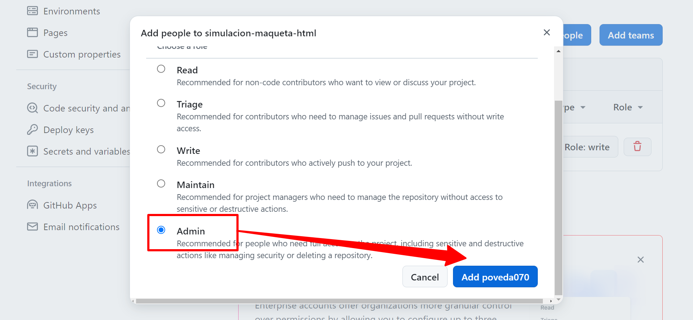
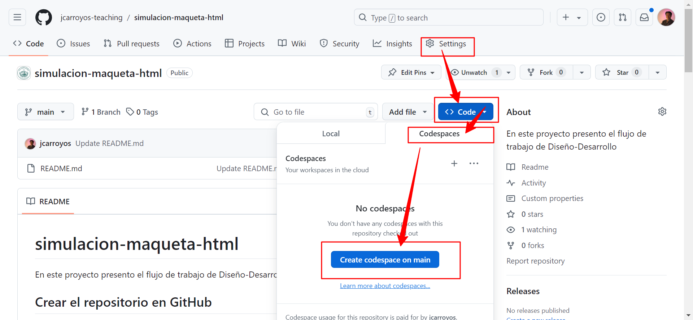
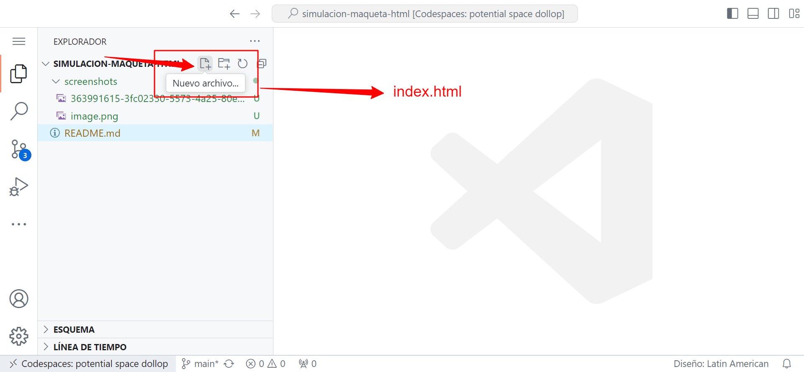
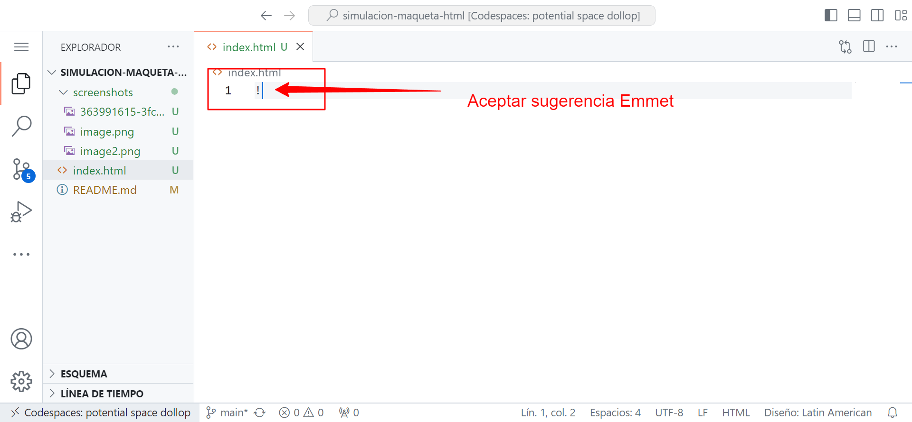
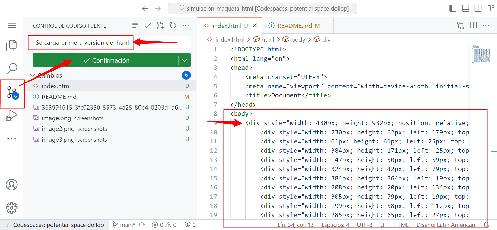
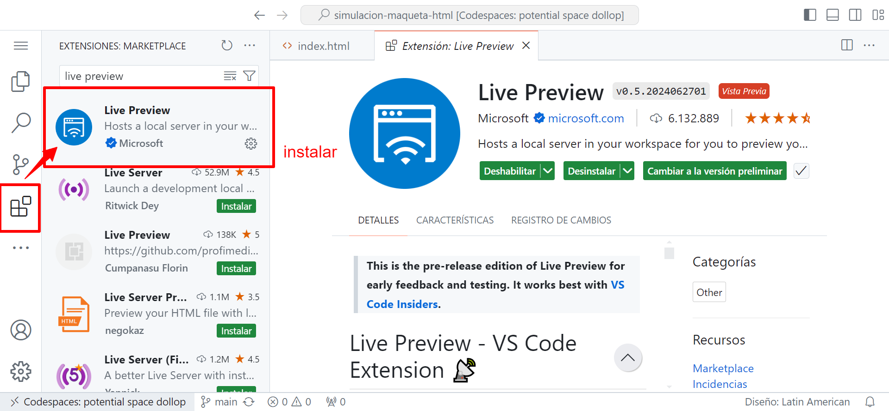
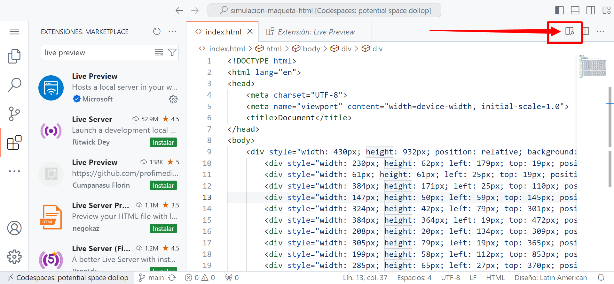
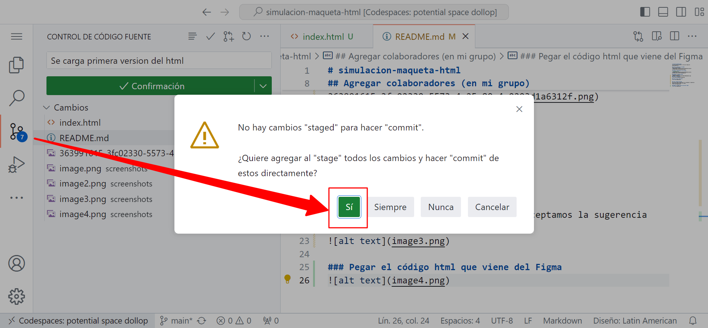
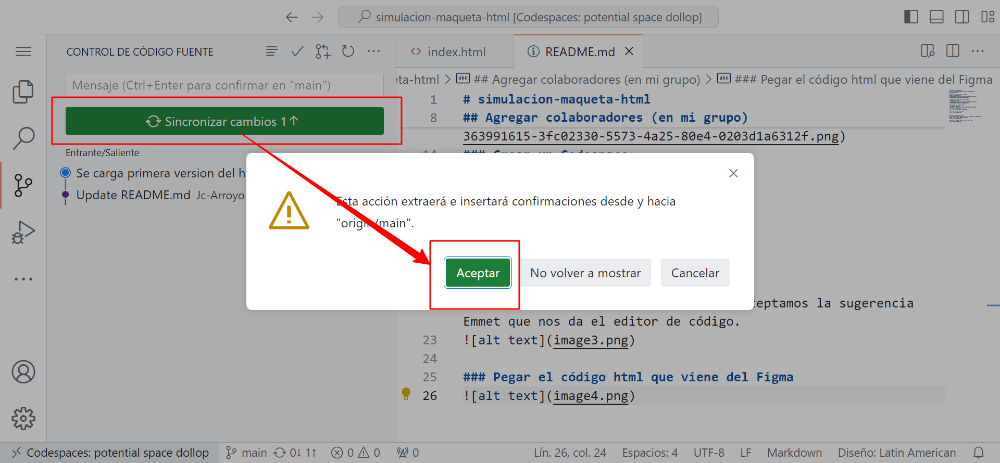
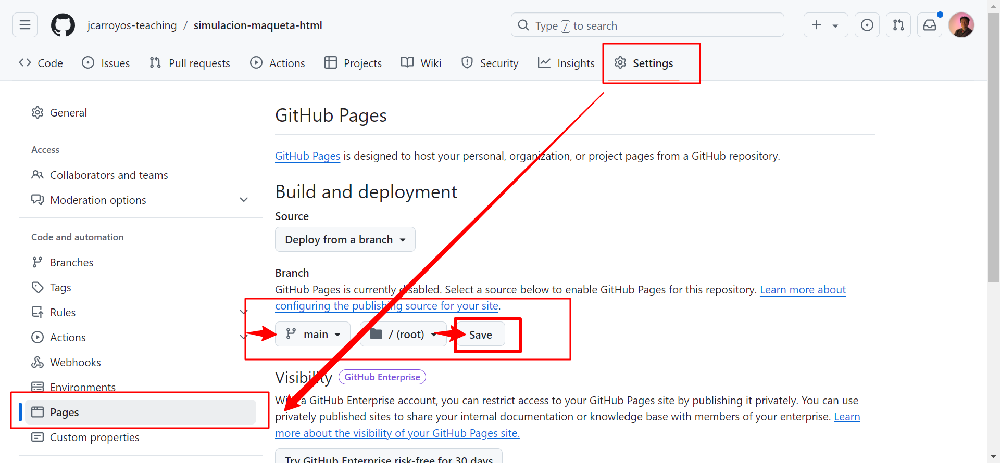

# simulacion-maqueta-html
En este proyecto presento el flujo de trabajo de Diseño-Desarrollo

## Crear el repositorio en GitHub
https://github.com/new

## Agregar colaboradores (en mi grupo)
`/settings/access`

### Asignar rol Administrador

### Crear un Codespace

### Crear archivo index.html

### Crear código base HTML
Se escribe signo de admiración `!` y aceptamos la sugerencia Emmet que nos da el editor de código.

### Pegar el código html que viene del Figma
Dentro de la etiqueta `<body>`

## Instalar plugin Live Preview

### Ver la vista previa del index.html

## Hacer commit
Es la forma en Git de gurdar cambios

### Sincronizar cambios
Es la forma en git de publicar estos cambios en el repositrio, en este caso diréctamente a la rama `main`

## Publicar la página
para esto usamos la característica **Github Pages**

